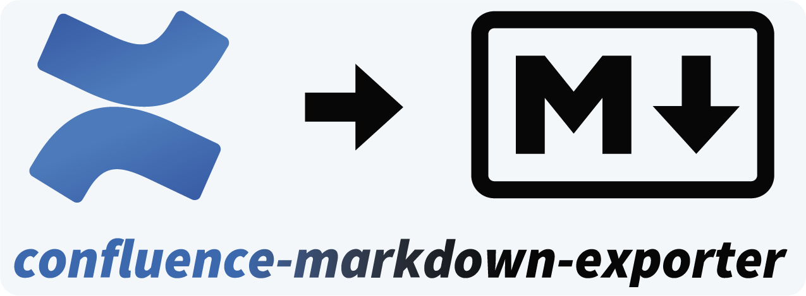

<figure markdown="span">
  { width="420" }
</figure>

> Export Confluence pages to Markdown for Obsidian, Gollum, Azure DevOps, Foam, Dendron and any other Markdown-based platform.

Exports individual pages, pages with descendants, or entire Confluence spaces via the Atlassian API into clean Markdown. Skips unchanged pages by default, re-exporting only what has changed since the last run.

## What's in these docs

- **[Installation](installation.md)**: install and update the CLI in one command
- **[Usage](usage.md)**: export pages, descendants, spaces, or organisations
- **[Features](features.md)**: supported Confluence content, macros, and add-ons
- **[Configuration](configuration/index.md)**: every option with defaults and ENV vars
- **[Target systems](configuration/target-systems.md)**: Obsidian, Azure DevOps, and more
- **[Troubleshooting](troubleshooting.md)**: known issues and how to report

## Get started in 60 seconds

### 1. Install

=== "Linux / macOS"

    ```bash
    curl -LsSf uvx.sh/confluence-markdown-exporter/install.sh | sh
    ```

=== "Windows"

    ```powershell
    powershell -ExecutionPolicy ByPass -c "irm https://uvx.sh/confluence-markdown-exporter/install.ps1 | iex"
    ```

=== "pip"

    ```bash
    pip install confluence-markdown-exporter
    ```

=== "uv"

    ```bash
    uv tool install confluence-markdown-exporter
    # or, one-shot run without installing:
    uvx confluence-markdown-exporter --help
    ```

=== "Docker"

    ```bash
    docker pull spenhouet/confluence-markdown-exporter:latest
    docker run --rm spenhouet/confluence-markdown-exporter --help
    ```

    The Docker image is intended for non-interactive / CI use; see the [Docker page](docker.md) for config-file mounts and environment variables.

### 2. Authenticate

=== "Local"

    ```bash
    cme config edit auth.confluence
    ```

=== "Docker"

    The container has no interactive menu. Generate the JSON config on a workstation first, then mount it (or pass credentials via `CME_AUTH__*` env vars):

    ```bash title="On your workstation"
    # Writes ~/.config/confluence-markdown-exporter/app_data.json
    cme config edit auth.confluence
    ```

    Copy that `app_data.json` to your CI repo or secret store, then mount it on every container run (next step). See the [Docker page](docker.md) for the env-var alternative.

### 3. Export

=== "Local"

    ```bash
    # A page, a subtree, an entire space, or every space of an org:
    cme pages   https://example.atlassian.net/wiki/spaces/SPACE/pages/123/Title
    cme spaces  https://example.atlassian.net/wiki/spaces/SPACE
    cme orgs    https://example.atlassian.net
    ```

=== "Docker"

    ```bash
    docker run --rm \
      -v "$PWD/app_data.json:/data/config/app_data.json:ro" \
      -v "$PWD/output:/data/output" \
      spenhouet/confluence-markdown-exporter \
      pages https://example.atlassian.net/wiki/spaces/SPACE/pages/123/Title
    ```

Your Markdown lands in the configured `export.output_path` (current directory by default).
